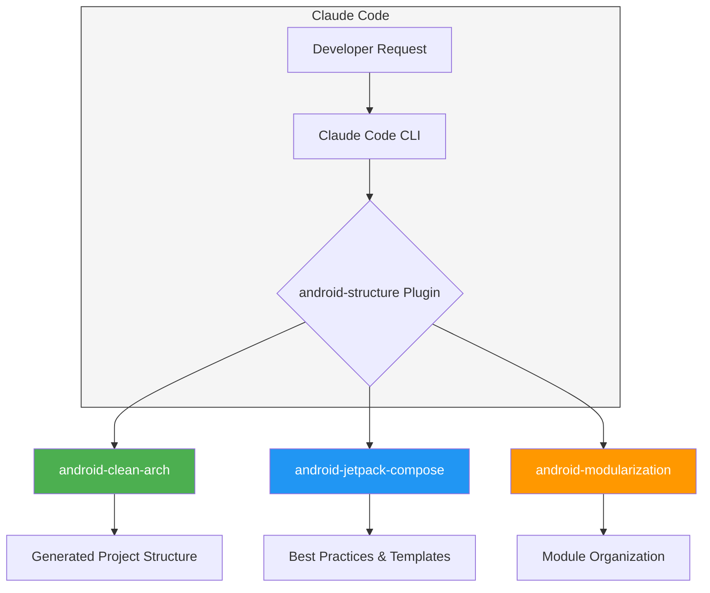
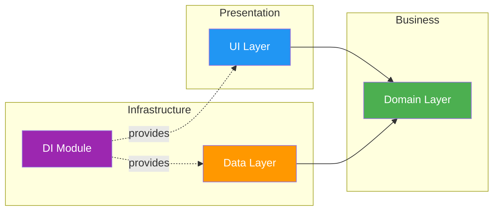

# android-structure

A Claude Code plugin that helps Android developers scaffold Clean Architecture projects with best practices.

[](https://github.com/anastr/android-structure)
[](LICENSE)

## Overview

**android-structure** is a Claude Code plugin designed to assist AI agents in generating well-structured Android applications. It provides skills for scaffolding Clean Architecture patterns, modularized projects, and Jetpack Compose UI code with performance optimization guidance.

## How It Works



### Clean Architecture Layers



## Features

- **Clean Architecture Generation** - Scaffolds Domain, Data, UI, and DI layers with proper separation of concerns
- **Jetpack Compose Best Practices** - Performance optimization tips, immutable collections, and recomposition prevention
- **Multi-Module Project Guidance** - Feature-based modularization patterns for scalable projects
- **DI Framework Support** - Ready-to-use templates for both Hilt and Koin

## Installation

Install the plugin using Claude Code CLI:

```bash
claude plugin add https://github.com/anastr/android-structure
```

## Skills

### android-clean-arch

Generates a complete Clean Architecture structure for Android apps.

**Parameters:**
- `basePackage` (required) - Base Java/Kotlin package path (e.g., `com.example.app`)
- `diLibrary` (optional) - DI framework: `hilt` (default) or `koin`

**Usage Example:**
```
Use the android-clean-arch skill with basePackage com.example.myapp
```

### android-jetpack-compose

Provides best practices and guidelines for Jetpack Compose UI development.

**Topics covered:**
- Immutable Models and Collections
- Reusable Components organization
- Material Theme Colors management
- Date Formatting utilities

**Usage Example:**
```
Use the android-jetpack-compose skill to help me optimize my Compose UI
```

### android-modularization

Defines best practices for multi-module Android projects.

**Module Types:**
- `:app` - Main application module
- `:feature:*` - Feature modules (auth, profile, settings)
- `:core:*` - Infrastructure modules (network, database)
- `:common:*` - Shared utilities and UI components

**Usage Example:**
```
Use the android-modularization skill to structure my project
```

## Generated Structure

When using `android-clean-arch`, the following structure is generated:

```
{basePackage}/
├── domain/
│   ├── model/          # Business entities (immutable data classes)
│   ├── repository/     # Repository interfaces
│   ├── usecase/        # UseCase interfaces
│   └── mapper/         # Domain-to-domain mappers
├── data/
│   ├── model/          # DTOs for API/Database
│   ├── datasource/     # Data source abstractions
│   ├── repository/     # Repository implementations
│   ├── usecase/        # UseCase implementations
│   └── mapper/         # DTO-to-domain mappers
├── ui/
│   ├── nav/            # Navigation components
│   ├── screen/         # Screen composables
│   ├── reusable/       # Reusable UI components
│   └── fake/           # Fake data for previews
└── di/                 # Dependency injection modules
```

## License

```
Copyright 2026 Anas Altair

Licensed under the Apache License, Version 2.0 (the "License");
you may not use this file except in compliance with the License.
You may obtain a copy of the License at

    http://www.apache.org/licenses/LICENSE-2.0

Unless required by applicable law or agreed to in writing, software
distributed under the License is distributed on an "AS IS" BASIS,
WITHOUT WARRANTIES OR CONDITIONS OF ANY KIND, either express or implied.
See the License for the specific language governing permissions and
limitations under the License.
```

## Author

**Anas Altair** - [GitHub](https://github.com/anastr)
